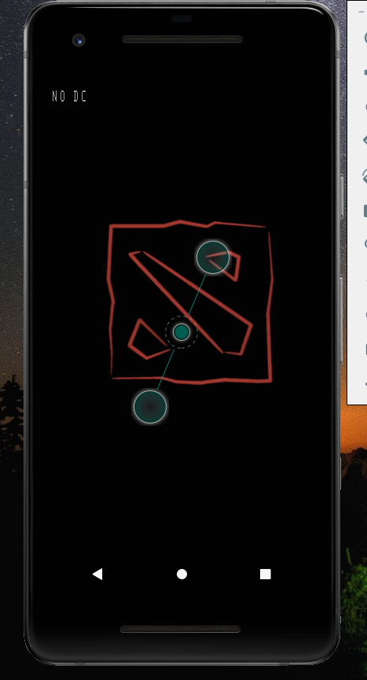

<h1 align="center">Dota2TOGO<h1>
  
---
APP Version : 1.0.0
  
---
This is the github respository for Dota2TOGO android applicaiton.
  
(Linyan Liu's University of Regina CS455 Class Final Project.)


## Content Lists:

1. [Configuration instructions](#Configuration-instructions)

2. [Installation instructions](#Installation-instructions)

3. [Operating instructions](#Operating-instructions)

4. [manifest](#manifest)

5. [Copyright information](#Copyright-information)

6. [Contact information](#Contact-information)

7. [Bug list](#Bug-list)

8. [Troubleshooting tips](#Troubleshooting-tips)

9. [Credits and acknowledgments](#Credits-and-acknowledgments)


## Configuration instructions
Dota2TOGO app targets Android 9.0 (API 28) or newer visions of android system. 

The app is created by react native and the expo -cli in Visual Studio Code.

It is specificly designed for android, but it still can run on IOS 10 or newer visions of ios system.
(May not have correct format for all functions or pages)

This is a mobile applicaiton and can only run on two mobile system, the Webview react native component does not support web.

You can use the Expo -cli on Visual Studio Code to access the project code on all Windows, macOS, or Linux system.

## Installation instructions
Android:

The apk can be download at links below:
  
https://drive.google.com/file/d/1ZdmI2JEW-KQV1laF84ThzK6L5TJ8Dbo5/view?usp=sharing

Visual Studio Code:
1. Download Visual Studio Code 

2. Install and open VSC

3. [Initialize an Expo codebase](https://docs.expo.dev/get-started/create-a-new-app/)  on your machine with  [Expo CLI](https://docs.expo.dev/get-started/installation/#1-expo-cli)

4. Download the Code zip file from https://github.com/BlinkBlinkSAO/CS455-Dota2-app-project

5. Unzip it into a folder and open it with VSCode

6. open the terminal in the VSCode and run the command line "npm install" and "expo start"

7. Use the Metro Bundler to run the code on android or ios system (either on real device or simulator.)

## Operating instructions
- There are 5 basic function screens and one setting page screen.
- Five selections on the bot navigation bar are:

- Home screen page: welcome page and the Dota2 Game todos function:


- Hero screen page: user can check the heroes list and find the hero information detail.


- News screen page: user can check the Latest News list and find the news information detail.


- Esports screen page: user can check the League calender and watch the real time gameplay or replays.


- Updates screen page: user can check the Latest and previous game patch updates.


- There is a setting icon on the home page and will route into the setting page. Here user can see the app functions.


- The app also has a slpash screen when user open the app.



## Manifest

```
- assets ----------> The extend folder for fonts and images used in the app.
- components ----------> Styletext and theme color tsx code folder for switch dark and light theme for the app.
- constants----------> Genarl folder for app layout code and the dark and light theme color style settings. 
- hooks ----------> codes for load app function and the usecolor scheme code for theme color change function.
- navigation ----------> The genarl code for index and the navigation layout, link Property etc.
- screens----> The main code folder for app page screens , with the basic function js code used in those page screens.
- App.tsx ----------> The start app.js file to run which will connect all different codes in the project.
- types.tsx----------> The code for initialize some global variables and types, which them are used in other functions.
- app.json ---->  the configures code file,that configures from app name to icon to splash screen and even deep linking scheme and API keys to use for some services.
- README.md ----> The README file for the github project repository and it is also the file you are reading right now.
```

## Copyright information
@ Linyan Liu, University of Regina
## Contact information
Linyan Liu 
  
lla670@uregina.ca or vocaloidmikusao@gmail.com
  
## Bug list
There is no Bug found for the app till now (04/14/2022), but the apk file have some compatibility issues for some specific phone model, I will keep eyes on those issues and try found some way to sovle them.
## Troubleshooting tips
Please send me an email if you have any trouble when you are using the app. 

See [Contact information](#Contact-information) for detail.
## Credits and acknowledgments
  
React-native 
  
Expo 
  
www.dota2.com
  
University of Regina Cs 455 class notes
  
Professor : Trevor Tomesh 

---
  
  Last Update Date: 04/14/2022
  
```
